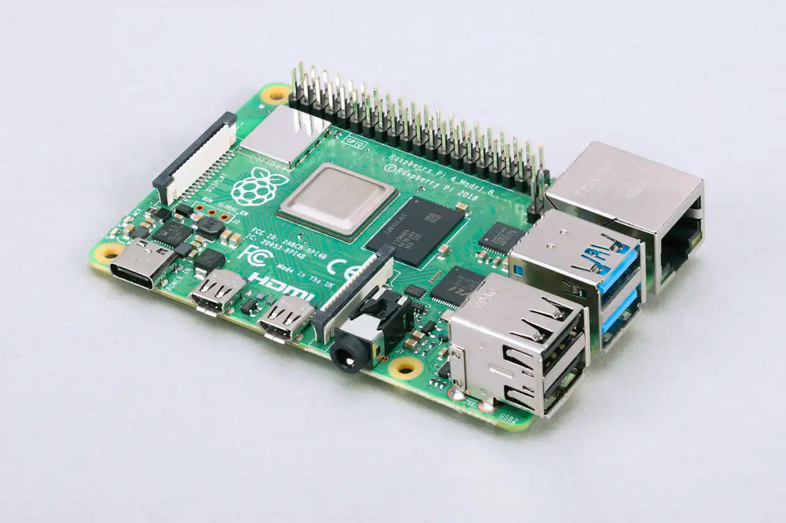
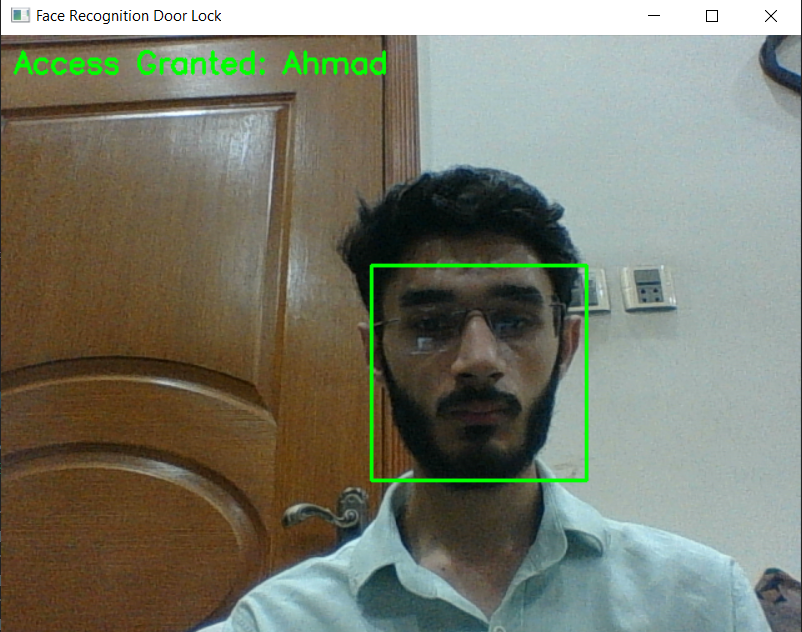

[](LICENSE)
[](https://www.python.org/)
[](https://opencv.org/)
[](http://dlib.net/)
[](https://www.raspberrypi.com/)
[](https://www.docker.com/)

[]()
[]()
[]()
[]()

# Face Recognition Door Lock 🔒

A low-cost, open-source door lock system powered by Python + OpenCV +
`face_recognition`. Show your face to a camera, if it matches a saved
face, the door unlocks. Otherwise, access denied.

Works with **any webcam** (or phone camera). Hardware for the actual lock
is **optional and swappable**, you can run it in pure simulation mode on
your laptop with zero extra hardware, or connect it to a Raspberry Pi,
Arduino, or an MQTT/IoT setup.



*Raspberry Pi 4 Model B, the recommended board for real hardware deployment. Image courtesy of Raspberry Pi Ltd.*

## 🎥 Demo



*Real-time detection: a registered face is matched and access is granted.*

## ✨ Features

- Real-time face detection & recognition from a webcam / IP camera
- Add new authorized faces with a single command
- Hardware-agnostic: works with **no hardware** (simulation), Raspberry Pi
  GPIO relay, Arduino over serial, or MQTT (ESP32 / smart home)
- Everything is controlled via one `config.yaml`, no code editing needed
- Docker support, so dependency issues (dlib/cmake) disappear
- Runs on Windows, Linux, macOS, and Raspberry Pi

## 🚀 Quick Start (Simulation mode, no hardware needed)

```bash
git clone https://github.com/your-username/face-door-lock.git
cd face-door-lock

pip install -r requirements.txt

# Register your face (SPACE to capture, ESC to cancel)
python add_face.py YourName

# Run the system
python face_door_lock.py
```

That's it, your webcam window will open. Show your face: if it matches,
you'll see "Access Granted" printed in the console (door "unlocks" in
simulation). Anyone else's face will show "Access Denied".

Press `q` in the video window to quit.

## 🐳 Even Easier: Run with Docker

No need to fight with dlib/cmake install issues:

```bash
docker build -t face-door-lock .
docker run --device=/dev/video0 -it face-door-lock
```

> Note: on Windows/Mac, passing a webcam into Docker is trickier, Docker
> on Linux (including Raspberry Pi OS) works best for this.

## ⚙️ Configuration (`config.yaml`)

Everything is controlled from one file, you never need to touch the
Python code.

| Setting | What it does |
|---|---|
| `camera_source` | `0` for default webcam, or a URL for an IP/phone camera |
| `match_tolerance` | Lower = stricter match, Higher = looser match (default `0.5`) |
| `unlock_duration_seconds` | How long the door stays open after a match |
| `cooldown_seconds` | Minimum time between two unlock triggers |
| `lock_type` | `none`, `gpio_relay`, `arduino_serial`, or `mqtt` |

### Using your phone as the camera (free, no extra hardware)
Install the **IP Webcam** app (Android) or similar, start the server, then
set in `config.yaml`:
```yaml
camera_source: "http://<phone-ip>:8080/video"
```

## 🔌 Hardware Options

### Option A: No hardware (testing / demo)
```yaml
lock_type: "none"
```
Just prints Access Granted / Denied to the console. Good for trying the
project out or for a portfolio/demo.

### Option B: Raspberry Pi + Relay + Electric Lock (recommended for a real door)
**Approx. parts cost:** Raspberry Pi (~$25 to $40) + USB/Pi camera (~$5 to $10) +
5V relay module (~$1 to $2) + 12V electric door strike / solenoid lock
(~$10 to $20) + power adapter.

Wiring:
```
Raspberry Pi GPIO 18  ---->  Relay IN
Relay COM/NO          ---->  12V Lock power line
5V + GND              ---->  Relay VCC + GND
```
```yaml
lock_type: "gpio_relay"
gpio_pin: 18
```
Install extra dependency: `pip install RPi.GPIO`

### Option C: Arduino (any lock/servo Arduino controls)
Connect Arduino via USB, upload a simple sketch that listens for `"UNLOCK"`
and `"LOCK"` strings on Serial and drives a relay/servo accordingly.
```yaml
lock_type: "arduino_serial"
serial_port: "/dev/ttyUSB0"   # Windows: "COM3"
baud_rate: 9600
```
Install extra dependency: `pip install pyserial`

### Option D: MQTT (wireless / ESP32 / smart home)
Good if you want the camera (running this Python script) and the actual
lock (e.g. an ESP32 near the door) to be physically separate and talk over
WiFi.
```yaml
lock_type: "mqtt"
mqtt_broker: "localhost"
mqtt_port: 1883
mqtt_topic: "door/lock"
```
Install extra dependency: `pip install paho-mqtt`

## 👤 Adding / Removing Authorized Faces

**Add a face:**
```bash
python add_face.py Ahmed
```
This opens your webcam, saves a photo to `known_faces/Ahmed.jpg`, and
clears the cache so it's picked up next run.

**Remove a face:** just delete the corresponding `.jpg` from
`known_faces/` and delete `encodings.pkl` (it will be rebuilt
automatically).

> 🔒 **Privacy note:** the `known_faces/` folder and `encodings.pkl` are
> already in `.gitignore`, your face photos will never be accidentally
> pushed to GitHub.

## 🛠️ Troubleshooting

| Problem | Fix |
|---|---|
| `dlib`/`face_recognition` fails to install | Use the Docker setup instead, it avoids all build tool issues |
| `RuntimeError: Unsupported image type, must be 8bit gray or RGB image.` | This is a **numpy/opencv/dlib version conflict**, not an image problem. Run `pip uninstall opencv-python numpy -y` then reinstall the exact pinned versions in `requirements.txt` (`numpy==1.26.4`, `opencv-python==4.9.0.80`). Delete `encodings.pkl` and retry. |
| `dlib` install crashes / hangs on Windows | Don't run `pip install dlib` directly (it compiles from source). Download a precompiled `.whl` matching your exact Python version from [z-mahmud22/Dlib_Windows_Python3.x](https://github.com/z-mahmud22/Dlib_Windows_Python3.x) and install with `pip install dlib-<version>-<tag>-win_amd64.whl` |
| Very slow `pip install` on a slow connection | Add `--timeout 300` to pip commands, or download the `.whl` manually from pypi.org ("Download files" tab, pick the file matching your Python version + `win_amd64`) and install with `pip install <file>.whl` |
| `ModuleNotFoundError` after everything was installed | Your virtual environment isn't activated. Run `<env-path>\Scripts\Activate.ps1` (Windows) or `source <env-path>/bin/activate` (Mac/Linux) before running the script; this must be done every time you open a new terminal |
| Camera not found | Try `camera_source: 1` or `2` in config.yaml, or check camera permissions |
| Recognizes wrong person / too loose | Lower `match_tolerance` (e.g. `0.4`) |
| Doesn't recognize valid face | Raise `match_tolerance` slightly (e.g. `0.55`), or add a couple more reference photos of that person |
| Slow / laggy on Raspberry Pi | Use Pi 4 or better; reduce camera resolution |
| Traceback ending in `KeyboardInterrupt` | Harmless, happens if you close with `Ctrl+C` in the terminal instead of pressing `q` in the video window. Always quit with `q` for a clean shutdown. |

## 📁 Project Structure

```
face-door-lock/
├── face_door_lock.py     # main script - run this
├── add_face.py            # helper to register new faces
├── lock_controller.py     # hardware abstraction layer
├── config.yaml            # all settings live here
├── requirements.txt
├── Dockerfile
├── known_faces/            # your registered face photos (gitignored)
└── README.md
```

## ⚠️ Disclaimer

This is a hobby/educational project. Face recognition is **not** a
substitute for a certified security system, lighting, photos, and
similar-looking people can cause false matches. Don't rely on this alone
for high-security applications.

## 📄 License

MIT, free to use, modify, and share. Contributions and PRs welcome!
